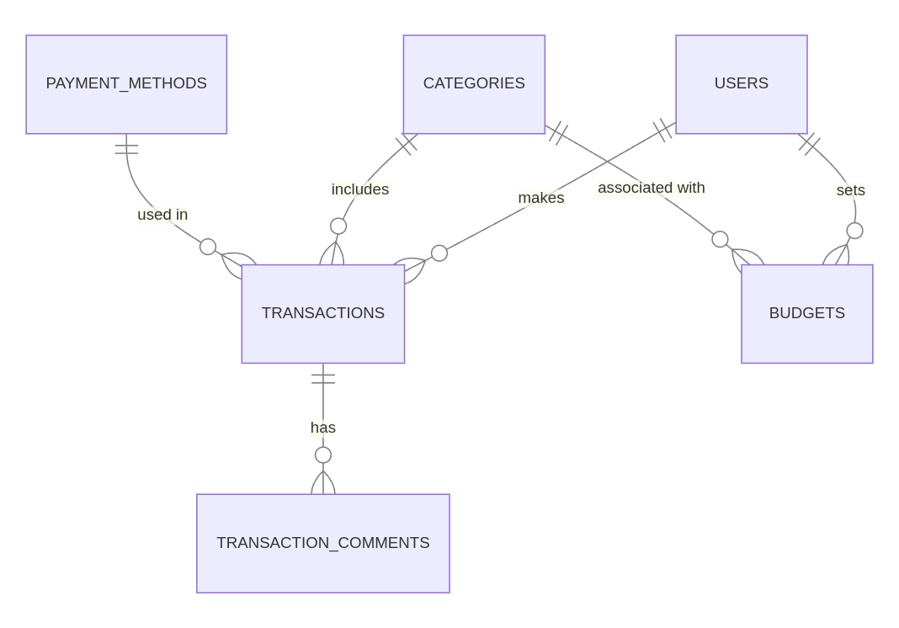

# Design Document

By Saw Paing Chit Min

Video overview: https://youtu.be/MHPB0P-Wzc0

## Scope

The purpose of the database is to help users manage and track their money. It keeps records of their income and expenses, helps them set budgets for different categories, and stores details about payment methods. Users can also add comments to transactions for personal notes.

The database scope includes:
* `Users`: People who are making transactions and setting budgets.
* `Categories`: Types of transactions like 'Salary', 'Rent', or 'Groceries'.
* `Payment Methods`: Ways users pay for their transactions, like 'Cash' or 'Credit Card'.
* `Transactions`: Records of how much money was spent or earned, with details like amount, type (income or expense), and date.
* `Budgets`: Monthly spending limits for each category.
* `Transaction Comments`: Notes that users add to explain or describe a transaction.

Things that are outside the scope of the database include:
* `Detailed financial records`: The database does not track personal bank accounts or loans.
* `External financial institutions`: The database doesn’t connect to banks or credit card companies.
* `Transaction receipts`: The database doesn’t store actual receipts or proof of payments.
* `External transaction history`: The database focuses on transactions within the app only, not on external systems or platforms.
* `Future budget plans`: It only tracks current budget settings, not future changes.

## Functional Requirements

A user should be able to:
* Add their income and expense transactions.
* Set monthly budgets for different categories.
* See their total spending and income.
* View their transactions with details like amount, type, and date.
* Add comments to their transactions.
* Update or delete their transactions, budgets, and comments if needed.

A user cannot:
* Connect the database directly to their bank accounts or credit cards.
* Upload receipts or files as part of their transactions.
* Share their budgets or transactions with other users.
* Tracking transactions made on external platforms outside the app.
* Handle future budget predictions or advanced analytics.

## Representation

Entities are captured in SQLite tables with the following schema.

### Entities

The database includes the following entities:

#### Users

The `users` table includes:

* `id`: A unique identifier for each user as an `INTEGER`. This column has the `PRIMARY KEY` constraint.
* `username`: The name of the user as `TEXT`. This column has the `NOT NULL` and `UNIQUE` constraints to ensure no duplicate or empty usernames are added.
* `email`: The email address of the user as `TEXT`. This column has the `NOT NULL` and `UNIQUE` constraints to make sure each email is unique.
* `password`: The user’s password stored as `TEXT` for simplicity (although hashed in real implementation).This column has the `NOT NULL` constraint to ensure every user has a password.

This table helps manage user accounts and ensures data consistency with constraints.

#### Categories

The `categories` table includes:

* `id`: A unique identifier for each category as an `INTEGER`. This column has the `PRIMARY KEY` constraint.
* `name`: The name of the category (e.g., "Food", "Rent") as `TEXT`. This column has the `NOT NULL` and `UNIQUE` constraints to prevent duplicates or empty values.
* `type`: The type of category (`income` or `expense`) as `TEXT`. This column has the `NOT NULL` constraint with a `CHECK` constraint to ensure the value is either `income` or `expense`. 

This table ensures transactions can be grouped into clear, distinct categories.

#### Payment Methods

The `payment_methods` table includes:

* `id`: A unique identifier for each payment method as an `INTEGER`. This column has the `PRIMARY KEY` constraint.
* `name`: The name of the payment method (e.g., "Cash", "Credit Card") as `TEXT`. This column has the `NOT NULL` and `UNIQUE` constraints to ensure no duplicate or empty values are added.

This table allows users to track transactions by payment method, ensuring flexibility and accuracy.

#### Transactions

The `transactions` table includes:

* `id`: A unique identifier for each transaction as an `INTEGER`. This column has the `PRIMARY KEY` constraint.
* `user_id`: The ID of the user who made the transaction as an `INTEGER`. This column has the `NOT NULL` constraint. A `FOREIGN KEY` constraint references the `id` column in the `users` table. The `ON DELETE CASCADE` ensures transactions are deleted if the user is removed.
* `category_id`: The ID of the transaction’s category as an `INTEGER`. This column has the `NOT NULL` constraint. A `FOREIGN KEY` constraint references the `id` column in the `categories` table. The `ON DELETE CASCADE` ensures transactions are removed if the category is deleted.
* `payment_method_id`: The ID of the payment method used for the transaction as an `INTEGER`. A `FOREIGN KEY` constraint references the `id` column in the `payment_methods` table. The `ON DELETE SET NULL` ensures the payment method is set to `NULL` if the method is deleted.
* `amount`: The amount of the transaction as a `NUMERIC` type to support decimal values. This column has the NOT NULL constraint.
* `type`: The type of transaction (`income` or `expense`) as `TEXT`. This column has the `NOT NULL` constraint with a `CHECK` constraint to ensure the value is either `income` or `expense`. 
* `description`: A short description of the transaction as `TEXT` to provide additional details.
* `date`: The date and time of the transaction as a `NUMERIC` type, with `DEFAULT CURRENT_TIMESTAMP` to automatically record the current date and time when a transaction is added. This column has the `NOT NULL` constraint.

This table links transactions to users, categories, and payment methods, ensuring data accuracy and flexibility.

#### Budgets

The budgets table includes:

* `id`: A unique identifier for each budget as an `INTEGER`. This column has the `PRIMARY KEY` constraint.
* `user_id`: The ID of the user who set the budget as an `INTEGER`. This column has the NOT NULL constraint. A `FOREIGN KEY` constraint references the `id` column in the `users` table. The `ON DELETE CASCADE` ensures budgets are deleted if the user is removed.
* `category_id`: The ID of the category the budget applies to as an `INTEGER`. This column has the `NOT NULL` constraint. A `FOREIGN KEY` constraint references the `id` column in the `categories` table. The `ON DELETE CASCADE` ensures the budget is removed if the category is deleted.
* `monthly_limit`: The budget limit for the category in a month as an `INTEGER`. This column has the `NOT NULL` constraint.
* A `UNIQUE(user_id, category_id)` constraint ensures that each user can only have one budget per category.

This table helps users manage their finances by tracking monthly budgets for specific categories.

#### Transaction Comments

The `transaction_comments` table includes:

* `id`: A unique identifier for each comment as an `INTEGER`. This column has the `PRIMARY KEY` constraint.
* `transaction_id`: The ID of the transaction the comment is linked to as an `INTEGER`. This column has the `NOT NULL` constraint. A `FOREIGN KEY` constraint references the `id` column in the `transactions table`. The `ON DELETE CASCADE` ensures that comments are removed if the linked transaction is deleted.
* `comment`: A `TEXT` field where the user can add a specific note or description about the transaction.

This table allows users to add personal notes to transactions for better context and clarity.

### Relationships

The entity relationship diagram below shows the relationships between the entities in the database.

As explained in the diagram:

* A user can have 0 to many transactions. 0 if they have not made any transactions, and many if they have made more than one. A transaction is linked to one and only one user.
* A category can have 0 to many transactions. 0 if no transactions are made in that category, and many if multiple transactions are linked to it. A transaction is linked to one and only one category.
* A payment method can have 0 to many transactions. 0 if it is not used, and many if it is used for multiple transactions. A transaction is linked to one and only one payment method.
* A transaction can have 0 to many comments. 0 if no comments are added, and many if users add multiple comments for it. A comment is linked to one and only one transaction.
* A user can have 0 to many budgets. 0 if they do not set budgets, and many if they set budgets for different categories. A budget is linked to one and only one user.
* A category can have 0 to many budgets. 0 if no budgets are set for it, and many if multiple users set budgets for it. A budget is linked to one and only one category.

## Optimizations

I created several indexes and views to improve the performance of the database.

### Indexes

Indexes help speed up queries by making it faster to search for specific data. Here are the indexes I created:

* `transactions_user_id` and `budgets_user_id`: To quickly find transactions or budgets by user.
* `transactions_category_id` and `budgets_category_id`: To quickly find transactions or budgets by category.
* `transactions_user_category` and `budgets_user_category`: To optimize queries that filter by both user and category.
* `transactions_payment_method_id`: To make searches for transactions by payment method faster.
* `transaction_comments_transaction_id`: To speed up finding comments related to a specific transaction.

These indexes improve query performance, especially when searching, filtering, or joining tables.

### Views

Views make it easier to work with data by showing specific information in a simplified way. Here are the views I created:

* `transaction_details`: Shows transaction details with user and category names for better readability.
* `user_transaction_count`: Displays the total number of transactions each user has made.
* `user_budget_categories`: Shows users, their budgets, and the related categories.
* `categories_without_transactions`: Lists categories that have no transactions.
* `users_with_no_transactions`: Finds users with budgets but no transactions in those categories.

These views simplify complex queries and help users access data more easily and efficiently.

## Limitations

The current database design has some limitations:

* `Lack of support for shared budgets`: Users cannot create budgets that are shared with other users.
* `No recurring transactions`: The database does not handle recurring income or expense transactions automatically. Users have to enter each transaction manually.
* `Limited analytics`: The database focuses on basic functions like tracking income, expenses, and budgets. It does not provide advanced analytics or predictions for future spending.
* `No receipt storage`: Users cannot upload or attach receipts to their transactions.
* `No external connections`: The database does not integrate with external financial systems, such as bank accounts or credit cards.

These limitations mean the database is best suited for simple personal finance tracking and may not work well for more complex financial needs.
